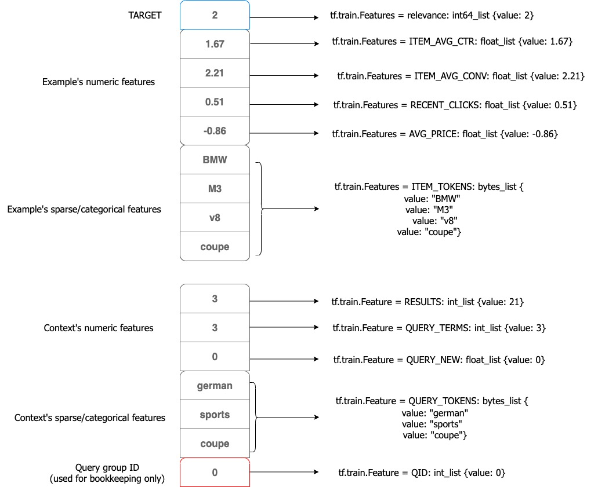

# Getting started: your data and TensorFlow Ranking 

If you've noticed, TensorFlow models don't exactly follow the scikit-learn API you may be used to as a python data guru with slick `.fit` and `.predict` methods that work with numpy arrays and pandas DataFrames. And since we're trying to *rank* things within a group, our data is naturally nested (items within a group). So when you're getting started with `tensorflow_ranking`, the first place to start is way before neural nets - it's with formatting your data correctly.

### Background

TensorFlow, originally released at the end of 2015, has been actively evolving owing to the dedication of thousands of active contributors. Its main competitor, as of 2020, seems to be PyTorch. One of its prior competitors, Keras, mainly provided wrappers around the TensorFlow graph API and exposed a much more scikit-learn-like interface to users for building models. For example Keras offers a `Model.fit` method, resembling that of a traditional scikit-learn estimator. By mid 2019, Tensorflow was on version 1.0.

By this point, Keras was growing in popularity because it was so simple to use relative to version 1 TensorFlow code. Since Keras was developed by a Google engineer and its main dependency was TensorFlow itself, Keras and Tensorflow were officially married in TensorFlow v2 in late 2019. Most of the v1 functionality is retained in v2 within the `compat.v1` submodule (`from tensorflow.compat.v1 import *`) should you need it.

Well, `tensorflow_ranking` does need it, so you'll frequently see v1 functionality referenced within TensorFlow Ranking code and examples while also seeing Tensorflow Ranking models implemented as Keras models. In fact, there is an entire `tensorflow_ranking.keras` submodule where Keras versions of ranking estimators have been implemented:

```
import tensorflow_ranking as tfr

model = tfr.keras.canned.DNNRankingNetwork(...)
```

Still, even the Keras versions of TensorFlow Ranking estimators remain rather cryptic relative to a typical Keras model. We'll see in later tutorials exactly what all of these arguments that you may have stumbled upon like `context_feature_columns` and `example_feature_columns` mean.

### Ranking data formats

Ranking is not as simple as classification and regression machine learning tasks. Those types of models generally assume *iid* datasets, i.e. sample *i* is independent of sample *j*. The same is not true in ranking datasets. Instead, we have *grouped* data. Specifically, we'll refer to a group of items within a query as a **query group**. Besides query groups, the smaller core units of currency are typically `queries` and `documents`, but these are terms that may differ depending on your use case. Avatria has query groups consisting of `items` nested within user `queries` (or sometimes `product lists`) as we work with ecommerce data. Airbnb has `searches` and `listings`. The New York Times has `queries` and `articles`.

Google has developed its own naming system:

* An **example** is an individual item being ranked. The goal of a ranking model is to sort `examples` as accurately and efficiently as possible. Each `example` has a `label`, or a relevance score, and per-`example` features. For example, the clickthrough rate of an article would be an `example` feature.
* The **context** is the `query`, the parent structure under which multiple **examples** are housed. Each `context` can also have features. For example, a customer queries "small dog non-shedding" has four tokens for which TensorFlow Ranking can learn word embeddings.

Going forward, we'll speak like this: "One query group is comprised of a context and multiple examples."

Ranking data, clearly, is nested. So the question becomes, how can we express a query group to Tensorflow in a way that's fast, flexible, and that can also allow us to store all types of features - numeric, categorical, and text-sequences?

#### Ranking data

One of the most common ways to store learning to rank data is in [SVMlight format](http://svmlight.joachims.org/), which you may also see referred to as `libsvm` format.

This format came about in the early 2000s when support vector machines were a more popular choice of machine learning model. SVMs were popular for a host of reasons, one of the main being its ability to efficiently handle high-dimensional feature spaces, such as representations of text via a bag-of-words model. In high-dimensional datasets (particularly for text data), the data is often sparse, i.e. a majority of samples' features are 0. The SVMlight data format, similar to [compressed row storage](https://en.wikipedia.org/wiki/Sparse_matrix), lets store only the non-zero feature values.

SVMlight files are just text files that follow the common pattern `<label> <feature index>:<value> <feature index>:<value> ... <feature index>:<value> # <comment>`. The `<comment>` is useful for storing metadata about each sample, perhaps a date or a user identifier that you can look up in a database to join more data to the SVMlight file in the future.

In 2002 the authors of SVMLight created a version of the SVM that could be used to learn pairwise preferences (e.g. `document_i > document_j`), which they called the Ranking SVM. They used the SVMlight format to incorporate `context` identifiers to support a "ranking mode" by including the `qid` field:

```
# target	qid	context_feature_0	context_feature_1	example_feature_0	example_feature_1
0	qid:0	0:13.0	1:-0.283	2:-0.104	3:-0.08	# context_id=33, example_id=55
1	qid:0	1:-0.283	2:-0.103	# context_id=33, example_id=77 (missing features 0, 3)
0	qid:1	0:32.1	2:-0.104	3:-0.068	# context_id=34, example_id=55 (missing feature 1)
1	qid:1	0:29.5	1:-0.283	2:-0.115	3:-0.068	# context_id=34, example_id=56
0	qid:1	2:0.78	3:-0.21	# context_id=34, example_id=77 (missing features 0, 1)
```

In Google terms, this dataset contains two queries representing **two contexts** each with **two and three examples**, respectively. While the SVMlight file format is easy to understand, it does not provide a clean way to delineate `example` features from `context` features, so this makes SVMlight not as efficient as we could be. Why should we have to redundantly write `context` feature values for a single query once for every example? Second, SVMlight provides no good way to represent text data - how would you use this to store the query "small dog non-shedding"? Well, first you would need to vectorize all text data with word embeddings or one-hot encoding, join it to `example` features, and then write everything back to SVMlight format.

Perhaps your data is not sparse, so you've stored it in standard text files. You probably have column that serves the same purpose as the `qid` field did in the SVMlight file, as well as a per-example relevance score.

| target  | qid |  context_feature_0  | context_feature_1  | example_feature_0  | example_feature_1  |
| ------- | --- | ------------------- | ------------------ | ------------------ | ------------------ |
|    0    |  0  |         13.0.       |        -0.283      |         -0.104     |        -0.08       |
|    1    |  0  |         0           |        -0.283      |         -0.103     |           0        |
|    0    |  1  |         32.1        |           0        |         -0.104     |        -0.68       |
|    1    |  1  |         29.5        |         -0.283     |         -0.115     |        -0.068      |
|    0    |  1  |         0           |           0        |          0.78      |        -0.21       |

This solves one of our problems - a generic text file makes it easy to store non-numeric data such as text sequences. But we're still writing `context` feature values once for every `example` in a query. Perhaps you could try splitting your `context` features off into one file and the `examples` features into another file, and joining on `qid` later on. Still, inevitably there would need to be a `join` step where the `context` features are joined to the `example` features, and then each context feature value would be reproduced across each individual `example`. Another downside - now we're duplicating the `qid` feature in multiple places.

As we'll see later on, the `ELWC` protobuf message will be the answer to our data representation question.


#### Formats compatible with TFR

Getting our data into an acceptable format for TFR was... tricky. It's not as simple as the traditional scikit-learn API. Our data has tons of text sequences in it, like product descriptions and customers' search queries, so SVMLight data files did not make a lot of sense. Besides, TFR doesn't really work like tools we had been used to in working with RankLib and LightGBM anyway:

```
import tensorflow_ranking as tfr

x_df = pd.read_csv('my_training_data.tsv', sep='\t')
y = x_df.y
group = x_df.group
x_df.drop(['y', 'group'], axis=1)

# -- this is not how tfr works
model = trf.Ranker()
model.fit(x_df, y, group)
```

Actually, it would be terrible if TFR forced us to work like this, because it would require you to load all of your data into memory! That's unlikely going to be the case. Ranking data for ecommerce and web search can get huge, often involving web tracking logs and hundreds of numeric, categorical, and text sequence fields.

Instead, Tensorflow works with `tensorflow.data.Datasets`, which you can think of as a fancy generator that returns batches of tensors. So your job as the user of TensorFlow Ranking, is to get . There are really just two options for getting your data to work with TFR:

1. Use your SVMlight or text files in tandem with the `tensorflow.data.Dataset` API. This is relatively complex, as it's on you to get the tensor shapes exactly correc: examples (2-d) are embedded within a context (1-d) which is represented within a fixed-length list tensor.
	- You can load your data into memory (e.g. into a `pandas.DataFrame`) and then turn the dataset into a generator. Then use the `tensorflow.data.Dataset.from_generator` function to transform your generator into a proper `Dataset` object. An example of consuming a pandas.DataFrame into a TFR-compatible `Dataset` can be found [here](https://prof.beuth-hochschule.de/fileadmin/prof/aloeser/shuaib_thesis.pdf).
	- In an early version of TFR you used to be able to turn SVMlight data files into generators by using the `tfr.data.libsvm_generator` data utility. This function has been deprecated.
2. Convert your data into `.tfrecords` files that hold ELWC protobufs (more on this below). This lets your use the `tfr.data.build_ranking_dataset` utility function to turn your files directly into `Dataset`s. There's high overhead to convert your data into `.tfrecords` files, but it will be worth it later on!

I cannot recommend enough you use option 2. Storing your data within ELWC protobufs within `.tfrecords` makes it easier not only to write data pipelines, but to obtain predictions from trained models later on. And we're not the only ones who recommend option 2. When Airbnb transitioned from lambdaMART (GBDT) models to neural rankers, they started by attempting a version of option 1 - loading .csv files, parsing their contents, and constructing batches of `context-example` samples in a `for` loop. [Here's](https://arxiv.org/pdf/1810.09591.pdf) what they found:

> The GDBT model was fed training data in CSV format, and we reused much of this pipeline to feed the TensorFlow models using `feed_dict`. At first glance this seems like a non-machine learning issue, and was quite low in our list of priorities. Our wake up call came when we found our GPU utilizations near ∼25%. Most of the training time was spent in parsing CSV and copying data through feed dict. We were effectively towing a Ferrari with a mule. Retooling the pipeline to produce training data as Protobufs and using [tensorflow.data.]Dataset gave a 17x speedup to training and drove GPU utilization to ∼90%...


### Google protobufs
As we have seen, the ranking objective implies requirements for our data storage that text files simply do not easily accommodate. Fortunately, Google created [protocol buffers](https://developers.google.com/protocol-buffers/docs/overview). Protocol buffers are basically a data format used for serializing structured data, kind of like how JSON is a text file representation of a Javascript object, only more rigid. We'll refer to a protocol buffer simply as a "proto". Protos were specifically designed to be easy to understand and fast, and TensorFlow is optimized to injest proto data.

A proto is really just a class definition for a structured data object - Google's proto system comes with a pseudo programming language (Wikipedia refers to it as an "interface description language") for defining protos. For example, I can represent a "car" object like this:

```bash
message Car {
	required string make = 1;
	required string model = 2;
	required string VIN = 3;
	optional int32 cylinders = 4;
	optional int32 voltage = 5;
	repeated OptionsPackage options_packages = 6;
}
```

So this proto definition implies a few things:
- Cars are `required` to have exactly one `make`, `model`, and `VIN` field value.
- Cars might have some number of cylinders (for gasoline engines), but they might be EVs or hybrids and be powered by batteries with a certain voltage. Either is `optional`.
- Cars can have a variable (i.e. `repeated`) number of special options packages, where an `OptionsPackage` is *yet another* proto. This means that we can construct protos out of other protos. Perhaps your neighbor just bought a new BMW M5 with the Driving Assistance Plus Package and the Executive Package - then their M5 would contain two OptionsPackage protos.

Here are some important facts to know about protos:
* The numbers associated with each `field` have to be unique and contiguous.
* `repeated` field values are also `option`, meaning that they can be repeated zero or many times.
* Protos support providing `default` field values.
* Different proto types can be imported from other `.proto` files.
* There are a couple of different `proto` syntaxes, 2 and 3 are the biggest. You'll see the syntax defined at the top of the `.proto` file where different types of protos are defined.
* Sometimes the `required` keyword is omitted - we believe this still means that the field is implicitly `required`, like in the `Result` message published on Google's developer guide:
```bash
message Result {
  string url = 1;
  string title = 2;
  repeated string snippets = 3;
}
```

Protos allow us to easily template a query group. We can just have one proto that represents a `context` (for example, a search phrase and timestamp at which the search was issued) and another proto type that represents an `example` (for example, a product SKU, name and price). Then we can build yet another, larger proto comprised of exactly one `context` and a list of `examples`. Why not name this proto `ExampleListWithContext`? Well, that's exactly what the creators of Tensorflow Ranking did.

### ELWC protos and TF Records files

What would an ELWC look like? [Here](https://github.com/tensorflow/serving/blob/master/tensorflow_serving/apis/input.proto#L72) is the official proto definition:
```bash
message tensorflow.Example {
  Features features = 1;
}

message ExampleListWithContext {
  repeated tensorflow.Example examples = 1; // individual items/documents represented as list of examples
  tensorflow.Example context = 2; // search query respresented as single example
}
```

We'll get into what exactly the `Features` data type is in the next section of this guide, but for now, just think of it as a group of machine learning features. So each query group will be saved as one ELWC. Each ELWC contains one query `context` Example proto along with any number of `examples` Example protos. The `context` proto contains query-level feature values while the `examples` protos each contain the features for individual query results.

Don't be confused between the `Example` proto and the `example` representing an individual item within the query group. The terminology is indeed confusing! But the [basic outline](https://github.com/tensorflow/serving/issues/1628) of one query group formatted as an ELWC is decently straightforward when expressed as JSON:

```bash
// ELWC as JSON
{
  // One Example for context
  "context": {
    "<feature_name3>": <value>|<list>
    "<feature_name4>": <value>|<list>
  },

  // List of Examples for individual query results
  "examples": [
    {
      // Example 1
      "<feature_name1>": <value>|<list>,
      "<feature_name2>": <value>|<list>,
      ...
    },
    {
      // Example 2
      "<feature_name1>": <value>|<list>,
      "<feature_name2>": <value>|<list>,
      ...
    }
    ...
  ]
}
```

Something to notice in the JSON above, you'll see that the set of context feature names and the set of example feature names are mutually exclusive. This is not a requirement of the ELWC, but for the sake of using ELWCs to build TensorFlow Ranking estimators, we'll want separate feature names for each unique type of feature. For example, if we have a textual feature for both the context and for the examples, instead of naming those features both `text`, name one `query_text` and the other `product_text`. Eventually when we build our TFR ranker, the context and example features will be joined into a single tensor, and keeping feature names unique will be useful.

Once you have the ability to script out the conversion of your query groups into ELWCs, each ELWC will be written to a [Tensorflow Records](https://medium.com/mostly-ai/tensorflow-records-what-they-are-and-how-to-use-them-c46bc4bbb564) file using the `.tfrecords` file extension, a file format for storing the serialized protobuf data. As the file format would suggest, TensorFlow is optimized to work with TF Records files. You're also free to split up a training data set into multiple `.tfrecords` files and provide TFR a filepath to all of the `.tfrecords` files you would like to use for training/validation/testing.

While some may claim that "binary data takes up less space on disk," we found that the TF Records files were actually significantly larger than when the same dataset was saved in our default SVMlight format. Even still, despite the file size increase, storing our query groups as ELWC protos helped speed up training time significantly over the original approach - loading subsets of our data into `pandas.DataFrame`s and then parsing individual lines into batches of query groups. Even better, the TF Records approach is *much* more memory efficient. Instead of needing to load O(3)-O(4) Mb of training data from individual SVMlight files at a time, TFR can load individual batches of query groups on-demand, greatly reducing the training pipeline's memory footprint.


### Tensorflow `Feature` and `Features`
**Just a note:** while constructing our first ELWCs, you will see the word "feature" thrown around *a lot*. Just like the word "example," TensorFlow has overloaded the word "feature," only now by a factor of four or five. Just take it slow, read [this](https://github.com/tensorflow/serving/issues/1628) miraculous GitHub issue, and and use `tfr_helpers` to assist you with ELWC creation in the future.

We have arrived at the most granular part of the dataset conversion/compatibility process - converting individual feature values into types that will be compatible with TensorFlow. Overall, there are four steps in building one ELWC:

1. Convert feature values into the smallest proto type we'll use - `Feature` protos. For this we'll employ `tf.train.Feature`.
2. Group together query and context `Feature` protos into groups of named features that resemble feature vectors. For this we'll employ `tf.train.Features`.
3. Construct `Example` protos by passing `tf.train.Features` groups to `tf.train.Example`.
4. Stack multiple `Example` protos into an ELWC.

Recall that one of the reasons we're using ELWCs is because they will allow us to represent sequences as individual feature values. SVMlight forced us to store feature values in the format `j: x`. Well `tf.train.Feature` allows us to represent feature values more in the format `j: [x0, x1, ..., xn]`, which will be useful for learning to rank from product descriptions and product ratings. Scalar values will be represented in the format `j: [x]`.

There are three Tensorflow `Feature` types:

|       Original feature value type        | TF data type |  `tfr_helpers` function |                            applies to                      |
| ---------------------------------------- | ------------ | ----------------------- | ---------------------------------------------------------- |
|       `int`, `bool`, `int32`, `int64`    |  Int64List   |   `int64_feature`      |  integer-valued, boolean, or ordinally-encoded ML features |
|        `float`, `double`                 |  FloatList   |   `float_feature`      |              continuously-valued ML features               |
|               `str`, `bytes`             |  BytesList   |   `bytes_feature`      |          categorical features, word token sequences        |

[TensorFlow documentation](https://www.tensorflow.org/tutorials/load_data/tfrecord) on `tf.train.Feature` is better than most. If you look closely, you'll notice that `tf.train.Feature` objects are actually... wait for it... protos! 

```python
def float_feature(x):
    if not isinstance(x, list):
        x = list(x)

    return tf.train.Feature(float_list=tf.train.FloatList(value=x))

y = float_feature(0.78)
type(y)
```

```bash
<class 'tensorflow.core.example.feature_pb2.Feature'>
```

`pb2` is short for "protocol buffer syntax 2".

Now we can group together named `Feature` values together so that they resemble proper feature vectors, like what we're used to with pandas and sklearn. That is, a `tf.train.Feature` proto is a collection of named feature values. [Here](https://github.com/tensorflow/tensorflow/blob/v2.3.1/tensorflow/core/example/feature.proto#L78) are the formal proto definitions each of `Feature` and `Features`:

```bash
// storage for individual feature values
message Feature {
  // Each feature can be exactly one kind.
  oneof kind {
    BytesList bytes_list = 1;
    FloatList float_list = 2;
    Int64List int64_list = 3;
  }
}

// storage for groups of named Feature(s)
message Features {
  // Map from feature name to feature.
  map<string, Feature> feature = 1;
}
```

Suppose we have two example features, `x1: 0.52` and `x2: -1.34` and no context features. Then our query group would be represented with the following single feature vector:

```python
feature_dict = {'x1': _float_feature(0.52), 'x2': _float_feature(-1.34)}
tf.train.Feature(feature=feature_dict) # great argument name, right?
```

```bash
feature {
  key: "x1"
  value {
    float_list {
      value: 0.5199999809265137
    }
  }
}
feature {
  key: "x2"
  value {
    float_list {
      value: -1.340000033378601
    }
  }
}
```

Note: many functions and methods TensorFlow do not accept positional arguments, so a good rule of thumb is to write your TFR code in the style `function(arg=value)`. This is why the `feature` argument is named explicitly in the code above.


### Putting it all together in Python

Now that we understand all of the components required to represent a query group in proto format, lets build an ELWC in python. There are several ways to do it!

First, let's suppose we have an ecommerce query group. Suppose we have data from a car auction website, and a customer's query was "german sports coupe." The result set included three listings for different cars. After engineering some features such as each car's historical average clickthrough rate and count of recent clicks (Avatria's ecommerce LTR product uses these features and many more), we could write the data to a text file (scroll horizontally to see all feature values):


| TARGET  | QID | ITEM_AVG_CTR  | ITEM_AVG_CONV | RECENT_CLICKS  | AVG_PRICE  |             ITEM_TOKENS        | RESULTS     |      QUERY_TERMS       | QUERY_NEW | QUERY_TOKENS |
| ------- | --- | ------------- | ------------- | -------------- | ---------- | ------------------------------ | ----------- | ---------------------- | --------- | ----------------------------- |
|   2     | 0   |  1.67         |    2.21       |  0.51          |  -0.86     |  ['BMW', 'M3', 'v8', 'coupe']  |  3          |            3           | 1         | ['german', 'sports', 'coupe'] |
|   0     | 0   |  0.29         |    -1.82      |  -0.12          |  -0.89    |       ['MB', 'C300', 'coupe'   |  3          |            3           | 1         | ['german', 'sports', 'coupe'] |
|   1     | 0   |  0.23         |    0.98       |  0.44          |  0.34      |     ['Porsche', 'Cayman']      |  3          |            3           | 1         | ['german', 'sports', 'coupe'] |

First we need to cast each of the three individual search result `examples` into named TensorFlow `Feature` protos. For example, the first search result we'll encode so that it looks like this:




#### Building ELWCs in Python

Going back to the four steps involved in building an ELWC, build one in Python using our "german sports coupe" query data.

```python
from tensorflow_serving.apis import input_pb2
import tensorflow as tf
import tensorflow_helpers as tfrh

context_feature_dict = {'qid': tfrh.int64_feature([0])
						, 'query_tokens': tfrh.bytes_feature(['german', 'sports', 'coupe'])
						, 'query_new': tfrh.int64_feature([1])
						, 'query_terms': tfrh.int64_feature([3])
						, 'results': tfrh.int64_feature([3])}

example_feature_dicts = list()
example_feature_dicts.append({'item_tokens': tfrh.bytes_feature(['BMW', 'M3', 'v8', 'coupe'])
							  , 'item_avg_ctr': tfrh.float_feature([1.67])
							  , 'item_avg_conv': tfrh.float_feature([2.21])
							  , 'recent_clicks': tfrh.float_feature([0.51])
							  , 'avg_price': tfrh.float_feature([-0.86])})
example_feature_dicts.append({'item_tokens': tfrh.bytes_feature(['MB', 'C300', 'coupe'])
							  , 'item_avg_ctr': tfrh.float_feature([0.29])
							  , 'item_avg_conv': tfrh.float_feature([-1.82])
							  , 'recent_clicks': tfrh.float_feature([-0.12])
							  , 'avg_price': tfrh.float_feature([-0.89])})
example_feature_dicts.append({'item_tokens': tfrh.bytes_feature(['Porsche Cayman'])
							  , 'item_avg_ctr': tfrh.float_feature([0.23])
							  , 'item_avg_conv': tfrh.float_feature([0.98])
							  , 'recent_clicks': tfrh.float_feature([0.44])
							  , 'avg_price': tfrh.float_feature([0.34])})

# -- initialize ELWC proto. It comes with "context" Example proto attribute and 
# -- "examples" list-of-Examples attribute.
ELWC = input_pb2.ExampleListWithContext()

# -- convert context feature dict into context proto.
context_proto = tf.train.Example(features=tf.train.Features(feature=context_dict))

# -- modify the ELWC in-place by copying the context proto.
ELWC.context.CopyFrom(context_proto)

# -- now add examples to ELWC.
for example_feature_dict in example_feature_dicts:
	# -- each time you call ELWC.examples.add() it creates a new blank 'examples' entry in the ELWC.
	elwc_example_proto = ELWC.examples.add()
	
	# -- cast dict of named result Features to proto.
	example_proto = tf.train.Example(features=tf.train.Features(feature=example_feature_dict))
	
	# -- modify the ELWC in-place by copying the contents of the current example proto.
	elwc_example_proto.CopyFrom(example_proto)


print(ELWC)
```

```
examples {
  features {
    feature {
      key: "avg_price"
      value {
        float_list {
          value: -0.8600000143051147
        }
      }
    }
    feature {
      key: "item_avg_conv"
      value {
        float_list {
          value: 2.2100000381469727
        }
      }
    }
    feature {
      key: "item_avg_ctr"
      value {
        float_list {
          value: 1.6699999570846558
        }
      }
    }
    feature {
      key: "item_tokens"
      value {
        bytes_list {
          value: "BMW"
          value: "M3"
          value: "v8"
          value: "coupe"
        }
      }
    }
    feature {
      key: "recent_clicks"
      value {
        float_list {
          value: 0.5099999904632568
        }
      }
    }
  }
}
examples {
  features {
    feature {
      key: "avg_price"
      value {
        float_list {
          value: -0.8899999856948853
        }
      }
    }
    feature {
      key: "item_avg_conv"
      value {
        float_list {
          value: -1.8200000524520874
        }
      }
    }
    feature {
      key: "item_avg_ctr"
      value {
        float_list {
          value: 0.28999999165534973
        }
      }
    }
    feature {
      key: "item_tokens"
      value {
        bytes_list {
          value: "MB"
          value: "C300"
          value: "coupe"
        }
      }
    }
    feature {
      key: "recent_clicks"
      value {
        float_list {
          value: -0.11999999731779099
        }
      }
    }
  }
}
examples {
  features {
    feature {
      key: "avg_price"
      value {
        float_list {
          value: 0.3400000035762787
        }
      }
    }
    feature {
      key: "item_avg_conv"
      value {
        float_list {
          value: 0.9800000190734863
        }
      }
    }
    feature {
      key: "item_avg_ctr"
      value {
        float_list {
          value: 0.23000000417232513
        }
      }
    }
    feature {
      key: "item_tokens"
      value {
        bytes_list {
          value: "Porsche Cayman"
        }
      }
    }
    feature {
      key: "recent_clicks"
      value {
        float_list {
          value: 0.4399999976158142
        }
      }
    }
  }
}
context {
  features {
    feature {
      key: "qid"
      value {
        int64_list {
          value: 0
        }
      }
    }
    feature {
      key: "query_new"
      value {
        int64_list {
          value: 1
        }
      }
    }
    feature {
      key: "query_terms"
      value {
        int64_list {
          value: 3
        }
      }
    }
    feature {
      key: "query_tokens"
      value {
        bytes_list {
          value: "german"
          value: "sports"
          value: "coupe"
        }
      }
    }
    feature {
      key: "results"
      value {
        int64_list {
          value: 3
        }
      }
    }
  }
}
```

As promised, we have exactly one `context` proto and multiple per-car protos each stored under the  `examples` pro. An important aspect of ELWCs is that the items within the list are 


Constructing ELWCs like this is very strange because of all of the in-place manipulation of the `ELWC` object through linked objects like `elwc_example_proto`. You may be thinking, "If I've gone through all of this work to create a context proto and a list of example protos, why all of this confusing overhead to pass my protos into the actual `ELWC` container?" You can skip the confusing `CopyFrom` logic by constructing `ELWC`s using constructor arguments:

```python
ELWC = input_pb2.ExampleListWithContext(context=context_proto
									    , examples=example_feature_dicts)

```

Finally, we'll write each ELWC to TF Records files so that they can be consumed by a TensorFlow Ranking estimator for model training/validation and testing. Note: since the ELWC is a serialized data format, we have to cast this serialized representation to a string (text) when writing it to `.tfrecords` files.

```python
train_file = 'trainset.tfrecords'
with tf.io.TFRecordWriter(trainfile) as writer:
	writer.write(ELWC.SerializeToString())
```

Now we have to scale this logic to hundreds of thousands of query groups. This is what `tfr_helpers` is for - point the `converters` module at your data source (either a .tsv file, LibSVM file, or pandas.DataFrame) to create an ELWC generator. Then iterate over the generator and write all output ELWCs to a `.tfrecords` file for use as training data.


